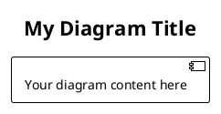
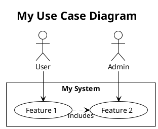
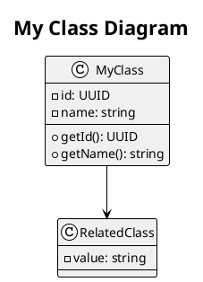
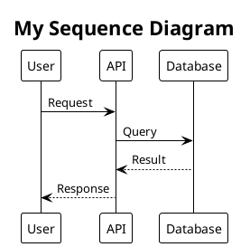
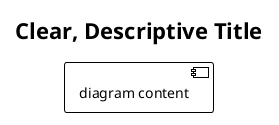
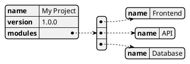

# PlantUML Diagram Guide

Complete guide for using PlantUML diagrams in your Web projects.

## Overview

**PlantUML** is a tool that allows you to create professional UML diagrams from simple text descriptions. All diagrams in this project use `.puml` file format and support multiple diagram types.

### Why PlantUML?

✅ **Version Control Friendly** - Text-based, easy to diff and merge
✅ **Automated Rendering** - Works in CI/CD pipelines
✅ **Professional Output** - High-quality SVG/PNG exports
✅ **Easy to Maintain** - Update source, not images
✅ **Multiple Formats** - Export to SVG, PNG, PDF, etc.

## Installation

### 1. Install PlantUML

#### Windows (Chocolatey)
```bash
choco install plantuml
```

#### macOS (Homebrew)
```bash
brew install plantuml
```

#### Linux (APT)
```bash
sudo apt-get install plantuml
```

#### Universal (Java + JAR)
```bash
# Download JAR from: https://plantuml.com/download
# Requires Java 8+ installed
java -jar plantuml.jar -version
```

### 2. VS Code Extension (Optional but Recommended)

Install **PlantUML** extension:
- ID: `jebbs.plantuml`
- Features: Preview, export, syntax highlighting

```
ext install jebbs.plantuml
```

### 3. Online Editor (No Installation)

Use **PlantUML Online Editor** at: https://www.plantuml.com/plantuml/uml/

## Included Diagrams

### 13 Ready-to-Use Diagram Templates

#### Use Case Diagrams (2)

| Diagram | File | Purpose |
|---------|------|---------|
| Web App Use Cases | `usecase_web_app_diagram.puml` | Overall app capabilities and actors |
| Auth Use Cases | `auth_usecase_diagram.puml` | Authentication flows and scenarios |

**Use When:** Defining system boundaries, user roles, features

#### Class Diagrams (2)

| Diagram | File | Purpose |
|---------|------|---------|
| Domain Model | `domain_model.puml` | Entities, value objects, relationships |
| Services | `services_diagram.puml` | Application services, interfaces |

**Use When:** Modeling domain, designing service contracts

#### Sequence Diagrams (2)

| Diagram | File | Purpose |
|---------|------|---------|
| Login Flow | `login_sequence.puml` | Step-by-step authentication process |
| Checkout Flow | `checkout_sequence.puml` | Complete order and payment flow |

**Use When:** Documenting complex flows, interactions between components

#### Component Diagrams (2)

| Diagram | File | Purpose |
|---------|------|---------|
| Frontend Architecture | `frontend_components.puml` | React components, pages, services |
| System Architecture | `system_architecture.puml` | Overall system layers and integrations |

**Use When:** Planning architecture, showing component dependencies

#### State Machine Diagrams (3)

| Diagram | File | Purpose |
|---------|------|---------|
| Form Validation | `form_states.puml` | Form field states and transitions |
| Order Lifecycle | `order_states.puml` | Order states from creation to delivery |
| Auth Session | `auth_states.puml` | Authentication session states |

**Use When:** Modeling stateful behavior, complex workflows

#### Other Diagrams (2)

| Diagram | File | Purpose |
|---------|------|---------|
| Deployment | `deployment_architecture.puml` | Infrastructure and deployment setup |
| Database ERD | `database_erd.puml` | Database schema and relationships |

**Use When:** Planning deployment, designing data model

## Using the Diagrams

### View in VS Code

1. Open `.puml` file
2. Right-click → **PlantUML: Open Preview**
3. Edit and see real-time updates

### Generate Images from Command Line

#### Generate SVG (Recommended)
```bash
plantuml -tsvg docs/uml/plantuml/domain_model.puml
# Output: docs/uml/plantuml/domain_model.svg
```

#### Generate PNG
```bash
plantuml -tpng docs/uml/plantuml/domain_model.puml
# Output: docs/uml/plantuml/domain_model.png
```

#### Generate All Diagrams
```bash
plantuml -tsvg docs/uml/plantuml/*.puml
# Generates SVG for all .puml files
```

### Batch Export Script

Create `export_diagrams.sh`:

```bash
#!/bin/bash

cd docs/uml/plantuml

echo "Exporting PlantUML diagrams to SVG..."
for file in *.puml; do
  echo "Processing $file..."
  plantuml -tsvg "$file"
done

echo "Done! SVG files created in the same directory."
```

Run:
```bash
chmod +x export_diagrams.sh
./export_diagrams.sh
```

### Embed in Documentation

#### In Markdown (with PlantUML plugin)

```markdown
# System Architecture

!include docs/uml/plantuml/system_architecture.puml
```

#### As Image

```markdown
# System Architecture


```

#### Inline PlantUML

```markdown
\`\`\`plantuml
@startuml
User --> API
API --> Database
@enduml
\`\`\`
```

## Customizing Diagrams

### Edit a Diagram

1. Open `.puml` file in text editor
2. Modify the PlantUML code
3. Save and regenerate

### Example: Add Component to Frontend Diagram

**Original:**
```plantuml
component Button
component Modal
```

**Modified:**
```plantuml
component Button
component Modal
component Tooltip
Tooltip --> Button
```

### Common Customizations

#### Change Colors
```plantuml
skinparam componentBackgroundColor #FFE4E1
skinparam componentBorderColor #FF6347
```

#### Add Notes
```plantuml
uc_browse : Notes
note right of uc_browse
  User can filter by category
  and price range
end note
```

#### Change Layout
```plantuml
skinparam direction TB  # Top to Bottom
skinparam direction LR  # Left to Right
skinparam linetype ortho  # Orthogonal lines
```

## Creating New Diagrams

### Template Structure



### Creating a Use Case Diagram



### Creating a Class Diagram



### Creating a Sequence Diagram



## Best Practices

### Naming

- Use descriptive names: `login_sequence.puml` not `seq1.puml`
- Include diagram type: `component_`, `sequence_`, `class_`
- Use lowercase with underscores: `system_architecture.puml`

### Organization

```
docs/uml/
├── plantuml/
│   ├── usecase_*.puml
│   ├── class_*.puml
│   ├── sequence_*.puml
│   ├── component_*.puml
│   ├── state_*.puml
│   └── [other types].puml
└── mermaid/
    ├── [existing Mermaid diagrams]
```

### Documentation



### Keep It Simple

- One responsibility per diagram
- Don't overcrowd with too many elements
- Use colors sparingly for emphasis
- Add notes for complex sections

## Exporting to CI/CD

### GitHub Actions Workflow

```yaml
name: Export PlantUML Diagrams

on:
  push:
    paths:
      - 'docs/uml/plantuml/**'

jobs:
  export:
    runs-on: ubuntu-latest
    steps:
      - uses: actions/checkout@v3

      - name: Install PlantUML
        run: sudo apt-get install -y plantuml

      - name: Export diagrams
        run: |
          cd docs/uml/plantuml
          for file in *.puml; do
            plantuml -tsvg "$file"
          done

      - name: Commit generated files
        run: |
          git add docs/uml/plantuml/*.svg
          git commit -m "chore: export PlantUML diagrams" || true
          git push
```

## Troubleshooting

### PlantUML not found

**Error:** `command not found: plantuml`

**Solution:**
```bash
# macOS
brew install plantuml

# Ubuntu/Debian
sudo apt-get install plantuml

# Windows
choco install plantuml
```

### GraphViz missing

**Error:** `Cannot find Graphviz`

**Solution:**
```bash
# macOS
brew install graphviz

# Ubuntu/Debian
sudo apt-get install graphviz

# Windows
choco install graphviz
```

### Export fails

**Check:**
- Java 8+ installed: `java -version`
- PlantUML JAR accessible
- File format is valid `.puml`
- Output directory exists

### Large diagrams slow to render

**Optimize:**
- Split into smaller diagrams
- Use `!include` for reusable components
- Remove decorative elements
- Check for circular dependencies

## Resources

### Official Documentation
- **PlantUML Guide:** https://plantuml.com/
- **Syntax Reference:** https://plantuml.com/guide
- **Online Editor:** https://www.plantuml.com/plantuml/

### Diagram Types
- [Use Case Diagram](https://plantuml.com/use-case-diagram)
- [Class Diagram](https://plantuml.com/class-diagram)
- [Sequence Diagram](https://plantuml.com/sequence-diagram)
- [Component Diagram](https://plantuml.com/component-diagram)
- [State Diagram](https://plantuml.com/state-diagram)
- [Deployment Diagram](https://plantuml.com/deployment-diagram)
- [Entity Relationship Diagram](https://plantuml.com/er-diagram)

### Tools & Extensions
- **PlantUML for VS Code:** [Marketplace](https://marketplace.visualstudio.com/items?itemName=jebbs.plantuml)
- **Draw.io Import:** Can import PlantUML files
- **GitHub Integration:** View .puml files directly

## Examples in Your Project

All diagrams are customizable starting points:

1. **Look at examples** in `/docs/uml/plantuml/`
2. **Read the syntax** - it's mostly plain English
3. **Modify for your project** - update actors, use cases, components
4. **Export to SVG** - version control the source, not images
5. **Embed in docs** - reference in design.md or ADRs

## Tips & Tricks

### Reusing Components

Create library file `lib_common.puml`:

```plantuml
' Common components
!define USER_COMPONENT component User
!define DB_COMPONENT component Database
```

Include in diagrams:

```plantuml
@startuml
!include lib_common.puml

USER_COMPONENT
DB_COMPONENT

@enduml
```

### Dynamic Diagrams

Use PlantUML JSON feature for data-driven diagrams:



### ASCII Output

Generate ASCII art for terminal/console:

```bash
plantuml -ttxt docs/uml/plantuml/diagram.puml
# Output: diagram.txt (ASCII art)
```

---

**Last Updated:** 2026-05-13

For more help, see [PlantUML Documentation](https://plantuml.com/)
