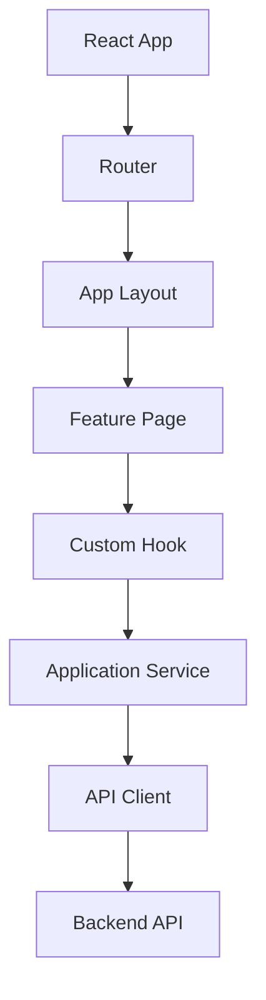
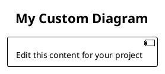

# Web Project Generator

[](https://www.python.org/)
[](./LICENSE)
[](https://github.com)
[](https://github.com)
[](https://github.com/psf/black)
[](./README.md)
[](https://react.dev/)
[](https://www.typescriptlang.org/)
[](https://vitejs.dev/)
[](#ai-agents)
[](https://mermaid.js.org/)
[](https://plantuml.com/)
[](#plantuml-diagrams)
[](#author)

> A comprehensive project structure generator for modern Web applications with AI agent integration, production-ready and battle-tested architecture.

**Author:** Jafte Carneiro Fagundes da Silva
**Version:** 1.0.0
**License:** MIT
**Last Updated:** 2026-05-13

## Overview

`create_project.py` is an automated tool that generates production-ready Web application project structures with:

- **Documentation System**: Organized knowledge base with 4-tier authority hierarchy
- **AI Agents**: 7 specialized agents for different roles
  - Web Developer, Frontend Architect, React Specialist
  - Code Review, Security Review, UML Modeling, Testing
- **Modern Tech Stack**: React + TypeScript + Vite + Vitest
- **Dual UML Support**:
  - **Mermaid**: 5+ lightweight diagrams (Flowcharts, Classes, Sequences, etc.)
  - **PlantUML**: 13 professional diagrams (Use Case, Component, State, Deployment, ERD, etc.)
- **Best Practices**: SOLID principles, accessibility, security, testing strategies

## Quick Start

### Prerequisites

- Python 3.8+
- (Optional) Node.js 18+ for generated projects

### Installation

```bash
# Clone or download the repository
cd dev_tools

# Run the generator
python create_project.py
```

### Basic Usage

```bash
$ python create_project.py

======================================================================
  Web Project Generator with AI Agent Structure
  Production-Ready Architecture
======================================================================

Project name: my-awesome-app
Project description (one sentence) [What problem does this project solve?]: Build a real-time collaboration tool for remote teams
Team members (ex: John - Frontend, Jane - Backend) [List team members and roles]: Alice - Frontend Lead, Bob - Backend, Carol - DevOps
Output directory [my_awesome_app]: ./my-awesome-app

[OK] Project structure generated successfully in: ./my-awesome-app

[NEXT] Next Steps:
  1. Review START_HERE.md and fill in project-specific information
  2. Update /docs/knowledge/core/00_project_context.md with project goals
  3. Install PlantUML: brew install plantuml graphviz
  4. Update /docs/design.md with your architecture and UML diagrams
  5. Customize PlantUML diagrams in /docs/uml/plantuml/
  6. Fill in /docs/knowledge/source-of-truth/ADR/ with your decisions
  7. Adjust agents in prompts/templates/ai-agents/ if needed
  8. Create src/ and public/ directories for your application
  9. Run: npm install
  10. Commit to Git
```

## Generated Project Structure

### Overview

```
my-awesome-app/
├── START_HERE.md                              # Entry point for humans and AI agents
├── AGENTS.md                                  # AI agent rules and guidelines
├── package.json                               # Node.js dependencies
├── tsconfig.json                              # TypeScript configuration
├── .gitignore                                 # Git ignore rules
│
├── docs/                                      # Complete documentation system
│   ├── plan.md                                # Current implementation plan
│   ├── tasks.md                               # Work items and progress
│   ├── design.md                              # System architecture and UML
│   ├── memory.md                              # Durable decisions and preferences
│   │
│   ├── knowledge/
│   │   ├── KNOWLEDGE_BASE.md                  # Documentation index (tier guide)
│   │   ├── KNOWLEDGE_GRAPH.md                 # Relationship-focused docs
│   │   │
│   │   ├── source-of-truth/                   # Tier 1: Authoritative
│   │   │   ├── ARCHITECTURE.md                # System architecture (read-only)
│   │   │   └── ADR/
│   │   │       └── ADR-001-example.md         # Architecture Decision Records
│   │   │
│   │   ├── core/                              # Tier 2: Core Knowledge (numbered)
│   │   │   ├── 00_project_context.md          # Project goals and scope
│   │   │   ├── 01_domain_model.md             # Domain concepts and rules
│   │   │   ├── 02_frontend_architecture.md    # Frontend layering
│   │   │   ├── 03_component_model.md          # Component patterns
│   │   │   ├── 04_api_integration.md          # API contracts
│   │   │   ├── 05_testing_strategy.md         # Testing approach
│   │   │   ├── 06_accessibility_strategy.md   # A11y standards
│   │   │   ├── 07_security_model.md           # Security model
│   │   │   └── 08_deployment_model.md         # Deployment architecture
│   │   │
│   │   ├── implementation/                    # Tier 3: Working documents
│   │   │   └── [implementation notes]
│   │   │
│   │   ├── meetings/                          # Meeting notes (date-prefixed)
│   │   │   └── 2026-05-13_kickoff.md
│   │   │
│   │   ├── team/                              # Team information
│   │   │   └── [team docs]
│   │   │
│   │   └── archive/                           # Tier 4: Historical (obsolete docs)
│   │       └── [old documentation]
│   │
│   ├── adr/                                   # Architecture Decision Records
│   │   └── [ADR files]
│   │
│   ├── uml/                                   # UML diagrams (Mermaid + PlantUML)
│   │   ├── mermaid/                           # Lightweight diagrams
│   │   └── plantuml/                          # 13 Professional diagrams
│   │
│   └── generated/                             # Generated artifacts
│       ├── PROGRESS_TRACKER.md                # Sprint progress and metrics
│       └── [generated reports]
│
├── prompts/
│   └── templates/
│       └── ai-agents/                         # AI agent prompts (source of truth)
│           ├── web_developer_agent.md         # Implements features
│           ├── frontend_architecture_agent.md # Design and routes
│           ├── react_specialist_agent.md      # React-specific challenges
│           ├── code_review_agent.md           # Code quality review
│           ├── security_review_agent.md       # Security analysis
│           ├── uml_modeling_agent.md          # UML diagram creation
│           └── testing_agent.md               # Testing strategies
│
├── .claude/
│   ├── commands/                              # Slash command wrappers
│   │   ├── web_developer.md                   # /dev command
│   │   ├── frontend_architecture.md           # /arch command
│   │   ├── react_specialist.md                # /react command
│   │   ├── code_review.md                     # /review command
│   │   ├── security_review.md                 # /security command
│   │   ├── uml_modeling.md                    # /uml command
│   │   └── testing.md                         # /test command
│   └── skills/
│
├── src/                                       # Your application source code
│   └── [to be created by you]
│
└── public/                                    # Static assets
    └── [to be created by you]
```

## Key Concepts

### 1. **Documentation Hierarchy (Tiers)**

The project uses a **4-tier authority system** to organize documentation:

#### Tier 1: Source of Truth
- **Location**: `/docs/knowledge/source-of-truth/`
- **Authority**: Absolute and binding
- **Examples**: ARCHITECTURE.md, ADRs, approved requirements
- **AI Rule**: Read-only; cite for authoritative claims
- **Updates**: Require explicit user approval

#### Tier 2: Core Knowledge
- **Location**: `/docs/knowledge/core/` (numbered files)
- **Authority**: High; foundational context
- **Examples**: Domain model, frontend architecture, component patterns
- **AI Rule**: Use as technical foundation
- **Updates**: Keep aligned with current architecture

#### Tier 3: Implementation & Working Documents
- **Location**: `/docs/`, `/docs/knowledge/implementation/`, `/docs/knowledge/meetings/`
- **Authority**: Helpful but evolving
- **Examples**: Sprint plans, task lists, meeting notes, design drafts
- **AI Rule**: Validate against Tier 1 and 2
- **Updates**: Change frequently; document important decisions

#### Tier 4: Archive
- **Location**: `/docs/knowledge/archive/`
- **Authority**: Historical reference only
- **Examples**: Obsolete documentation, deprecated approaches
- **AI Rule**: Never use as current truth
- **Status**: Clearly marked as archived

### 2. **AI Agents**

The project includes 7 specialized AI agents, activated via slash commands:

| Agent                          | Command      | Responsibility                                    |
|--------------------------------|--------------|---------------------------------------------------|
| Web Developer Agent            | `/dev`       | Implement features, write tests, refactor code   |
| Frontend Architecture Agent    | `/arch`      | Design routes, components, propose improvements  |
| React Specialist Agent         | `/react`     | Solve React hooks, state, performance problems   |
| Code Review Agent              | `/review`    | Quality, security, accessibility review          |
| Security Review Agent          | `/security`  | Threat modeling, vulnerability assessment        |
| UML Modeling Agent             | `/uml`       | Create and maintain system diagrams              |
| Testing Agent                  | `/test`      | Design tests, coverage strategies                |

**All agents follow mandatory initialization:**

```
1. Read START_HERE.md
2. Read /AGENTS.md
3. Read /docs/knowledge/KNOWLEDGE_BASE.md
4. Read /docs/design.md
5. Read /docs/plan.md and /docs/tasks.md
6. Read relevant Tier 1 and Tier 2 documents
```

### 3. **Project Files**

| File | Purpose |
|------|---------|
| **create_project.py** | Main generator - creates new Web projects |
| **plantuml_diagrams.py** | PlantUML templates (13 diagrams) |
| **README.md** | This comprehensive guide |
| **PLANTUML_GUIDE.md** | PlantUML installation & usage |
| **AUTHOR.md** | Author info & contributions |
| **BADGES.md** | Badge documentation |
| **STRUCTURE.md** | Project structure reference |
| **LICENSE** | MIT License |

### 4. **Core Working Files**

#### `/docs/plan.md`
- **Purpose**: Current implementation plan
- **Sections**: Objective, Scope, Architecture Impact, Testing Strategy, Acceptance Criteria
- **Use**: Before implementation; guides the team

#### `/docs/tasks.md`
- **Purpose**: Actionable work items
- **Sections**: Backlog, In Progress, Blocked, Completed, Verification Checklist
- **Use**: Track progress; prevent scope creep

#### `/docs/design.md`
- **Purpose**: System architecture and design decisions
- **Sections**: System Overview, Domain Model, Frontend Architecture, Component Architecture, UML Diagrams, Design Decisions
- **Use**: Reference during implementation; update when architecture changes

#### `/docs/memory.md`
- **Purpose**: Durable decisions and user preferences
- **Sections**: User Preferences, Approved Decisions, Rejected Decisions, Repository Conventions
- **Use**: Cross-session continuity; team memory

### 4. **UML-First Design**

UML is **mandatory** for non-trivial changes:

- **Use Case Diagrams**: Show actors, goals, and system boundaries
- **Class Diagrams**: Domain models and TypeScript interfaces
- **Sequence Diagrams**: Runtime interactions (components, services, APIs)
- **State Machine Diagrams**: Component states, form states, auth flows
- **Component Diagrams**: React components, pages, services, integrations
- **Deployment Diagrams**: Browser, CDN, servers, databases

Choose your preferred format:
- **Mermaid** - Lightweight, built into Markdown
- **PlantUML** - Professional, more diagram types

Both are version-control friendly and auto-generated in CI/CD pipelines.

**Example: Component Diagram**



## Usage Workflow

### 1. **Initialize Project**

```bash
python create_project.py
# Answer prompts about your project
```

### 2. **Review and Customize**

Open `START_HERE.md`:
- Update project summary and team
- Fill in technology stack
- Add credentials policy and first files to read

### 3. **Define Project Context**

Edit `/docs/knowledge/core/00_project_context.md`:
- Project goals and success criteria
- Target users and problem statement
- Scope (in/out), constraints, stakeholders
- Key assumptions and risks

### 4. **Design Domain Model**

Edit `/docs/knowledge/core/01_domain_model.md`:
- Define entities, value objects, aggregates
- Document business rules
- Create class diagrams

### 5. **Plan Architecture**

Edit `/docs/design.md`:
- System overview and layering
- Frontend architecture (pages, features, shared)
- Component and route architecture
- API contracts and data flow
- UML diagrams (Use Case, Component, Sequence, State Machine)

### 6. **Create ADRs**

Add decisions to `/docs/knowledge/source-of-truth/ADR/`:
```
ADR-001: React for Frontend
ADR-002: Context API for State Management
ADR-003: Vitest for Unit Testing
```

### 7. **Set Up Implementation Plan**

Fill `/docs/plan.md`:
- Objective, scope, constraints
- Implementation phases
- Testing strategy
- Acceptance criteria

### 8. **Start Development**

```bash
cd my-awesome-app
npm install
npm run dev
```

### 9. **Use AI Agents**

Activate agents via slash commands:

```
/dev - "Implement the login form with validation"
/arch - "Review component architecture and suggest improvements"
/test - "Write comprehensive tests for AuthService"
/review - "Review this code for quality and security"
/uml - "Create a sequence diagram for the checkout flow"
```

### 10. **Maintain Documentation**

After meetings or significant decisions:

1. Update `/docs/memory.md` with decisions
2. Create ADR if architectural
3. Update `/docs/design.md` if design changed
4. Update `/docs/tasks.md` with work items
5. Update `/docs/knowledge/KNOWLEDGE_BASE.md` if structure changed

## File Reference

### START_HERE.md

**Read this first.** Contains:
- Project summary and team
- Tech stack
- How to run, test, build, preview
- Key architecture decisions
- Documentation map
- Credentials policy
- First files to read (suggested order)

### AGENTS.md

Rules for all AI agents operating on this project:

- Mission and core principles
- Mandatory session initialization
- Document authority hierarchy
- Evidence and confidence rules
- UML requirements
- Language rules (English docs, code comments optional Portuguese)
- Clarifying questions strategy
- Non-negotiable rules

### /docs/knowledge/KNOWLEDGE_BASE.md

Complete documentation index:

- Authority hierarchy explained
- Concept clusters (Architecture, Domain, Components, Testing, etc.)
- Navigation paths (for new members, architecture review, implementation, post-meeting)
- Relationship map (Mermaid)
- Maintenance rules and triggers

### /docs/knowledge/core/* (8 files)

Numbered core knowledge files (read in order):

1. `00_project_context.md` — Goals, success criteria, stakeholders, constraints, risks
2. `01_domain_model.md` — Domain entities, value objects, business rules
3. `02_frontend_architecture.md` — Layering, folder structure, key decisions
4. `03_component_model.md` — Component classification, naming, patterns
5. `04_api_integration.md` — API overview, client structure, data mapping, error handling
6. `05_testing_strategy.md` — Testing philosophy, test types, organization, CI/CD
7. `06_accessibility_strategy.md` — WCAG standard, implementation guidelines, testing
8. `07_security_model.md` — Threat model, rules, CSP, dependency management
9. (Bonus) `08_deployment_model.md` — Deployment architecture, environments, build process

## Best Practices

### Documentation

- **Keep current**: Stale docs are worse than no docs
- **Use tiers wisely**: Tier 1 = approved, Tier 3 = drafts, Tier 4 = archive
- **Link across docs**: Use file paths and Mermaid diagrams
- **Date meeting notes**: Use `YYYY-MM-DD_topic.md` format
- **Archive obsolete docs**: Move to `/docs/knowledge/archive/` with banner

### Design

- **UML for non-trivial changes**: Use Mermaid in `/docs/design.md`
- **Sequence diagrams for complex flows**: Show interactions between components, services, APIs
- **State machines for UI**: Model form, auth, checkout states
- **Class diagrams for domain**: Show entities, value objects, services

### Code

- **Respect tiers**: Never contradict Tier 1 documents
- **Quote sources**: Use `file.md:L10-L15` format
- **Mark confidence**: HIGH (Tier 1 or code), MEDIUM (Tier 2), LOW (inferred)
- **Ask clarifying questions**: Better than assuming

### Agents

- **Initialize sessions**: All agents read setup docs first
- **Cite evidence**: Repository context over speculation
- **Update memory**: Record durable decisions in `/docs/memory.md`
- **Maintain UML**: Keep diagrams synchronized with code

## Troubleshooting

### "Project name is required"

Provide a name when prompted. Can't be empty.

### Directory already exists

If the target directory is not empty, you'll be asked to confirm. Choose yes to continue.

### UnicodeEncodeError

Ensure your terminal supports UTF-8. The script uses ASCII-safe output by default.

### Missing dependencies

After project generation, run:

```bash
cd your-project
npm install
```

## Advanced Usage

### Customizing Agents

Edit agent prompts in `/prompts/templates/ai-agents/`:

```bash
# Before: Custom agent workflow
/dev - "Implement feature X"

# After: Edit the agent, then
/dev - "Implement feature X"
```

Agent changes take effect immediately in Claude Code.

### Adding Custom Knowledge

Create new files in `/docs/knowledge/core/` or `/docs/knowledge/implementation/`:

```markdown
# 09_custom_topic.md

> Custom documentation
> Authority: Tier 2 or Tier 3
> Status: Active
> Last Updated: 2026-05-13

[Your content]
```

Then update `/docs/knowledge/KNOWLEDGE_BASE.md` to reference it.

### Creating ADRs

Copy `/docs/knowledge/source-of-truth/ADR/ADR-001-example.md` and fill in:

```markdown
# ADR-002: [Your Decision]

> Status: Proposed / Accepted / Deprecated
> Date: [Today]

## Context
[Why was this decision needed?]

## Decision
[What was decided?]

## Rationale
[Why?]

## Consequences
[Positive and negative impacts]
```

## Architecture Principles

This generator enforces these principles:

1. **Repository Grounding**: All decisions based on repository evidence
2. **Tier Authority**: Tier 1 always wins; lower tiers must align
3. **Evidence-Based**: Claims cited with file paths and line numbers
4. **UML-First**: Design documented with diagrams before code
5. **Accessibility by Default**: WCAG 2.1 Level AA as baseline
6. **Security by Design**: Threats identified and mitigated upfront
7. **Testability**: Code designed to be tested (unit, component, E2E)
8. **Maintainability**: Clear intent, minimal coupling, SOLID principles
9. **Modularity**: Cohesive modules with clean boundaries
10. **Documentation**: Decisions recorded, architecture explained

## Examples

### Example 1: Create a Login Feature

```bash
/dev - "Design the login feature"
# Agent creates UML sequence diagram in /docs/design.md
# Agent creates component plan
# Agent identifies accessibility and security requirements

/arch - "Review the login architecture"
# Agent validates against ARCHITECTURE.md
# Agent suggests improvements

/test - "Write login tests"
# Agent creates unit, component, and E2E test plans

/dev - "Implement the login form"
# Agent writes LoginPage.tsx, LoginForm.tsx, useLoginForm.ts
# Agent writes tests
# Agent creates ADR for auth flow decisions
```

### Example 2: Refactor State Management

```bash
/arch - "How should we manage global state?"
# Agent reviews current state, proposes options
# Creates comparison table in /docs/design.md

/dev - "Implement Context API for auth state"
# Agent refactors to use Context
# Updates component tree diagrams
# Writes tests

/review - "Review the state management refactor"
# Agent checks for coupling, context boundaries, performance
# Suggests optimizations

/uml - "Update the Component Diagram"
# Agent creates updated diagram showing providers
```

## Support

For issues or questions:

1. Check `/docs/knowledge/KNOWLEDGE_BASE.md` for navigation
2. Review relevant `/docs/knowledge/core/*.md` files
3. Look at examples in `/docs/design.md`
4. Ask Claude Code agents using `/dev`, `/arch`, `/review`, etc.

## UML Diagrams: Mermaid & PlantUML

This project includes **dual UML support** with Mermaid for lightweight diagrams and **13 professional PlantUML templates**.

### Mermaid vs PlantUML Comparison

| Feature | Mermaid | PlantUML |
|---------|---------|----------|
| **Setup** | No install needed | Requires installation |
| **Best For** | Quick, lightweight | Professional, complex |
| **Diagram Types** | 8+ basic types | 13+ comprehensive types |
| **Version Control** | Excellent | Excellent |
| **Learning Curve** | Very easy | Easy-Medium |
| **Export Options** | SVG, PNG | SVG, PNG, PDF, ASCII |
| **IDE Integration** | Many plugins | VS Code, IntelliJ |
| **Mermaid Markdown** | Native support | With plugin |

**Recommendation**: Use **Mermaid** for documentation; use **PlantUML** for architecture documents.

### PlantUML: 13 Professional Diagrams

#### Available Diagrams

```
docs/uml/plantuml/
├── [Use Cases] (2)
│   ├── web_usecase_diagram.puml           # Web app capabilities
│   └── auth_usecase_diagram.puml          # Auth flows
│
├── [Classes] (2)
│   ├── domain_model.puml                  # Domain entities
│   └── services_diagram.puml              # Services & interfaces
│
├── [Sequences] (2)
│   ├── login_sequence.puml                # Login flow steps
│   └── checkout_sequence.puml             # Checkout process
│
├── [Components] (2)
│   ├── frontend_components.puml           # React components
│   └── system_architecture.puml           # System layers
│
├── [State Machines] (3)
│   ├── form_states.puml                   # Form validation states
│   ├── order_states.puml                  # Order lifecycle
│   └── auth_states.puml                   # Auth session states
│
├── [Deployment] (1)
│   └── deployment_architecture.puml       # Infrastructure
│
└── [Database] (1)
    └── database_erd.puml                  # Entity relationships
```

### Quick Start: PlantUML

#### 1. Install PlantUML

```bash
# macOS (Homebrew)
brew install plantuml graphviz

# Ubuntu/Debian (APT)
sudo apt-get install plantuml graphviz

# Windows (Chocolatey)
choco install plantuml graphviz

# Or use online editor: https://www.plantuml.com/plantuml/uml/
```

#### 2. Generate Diagrams

```bash
# Convert .puml to SVG
plantuml -tsvg docs/uml/plantuml/domain_model.puml

# Convert all diagrams
plantuml -tsvg docs/uml/plantuml/*.puml

# Generate PNG
plantuml -tpng docs/uml/plantuml/*.puml
```

#### 3. View in VS Code

1. Install extension: **PlantUML** (`jebbs.plantuml`)
2. Open any `.puml` file
3. Right-click → **Open Preview**
4. Edit and see real-time updates

#### 4. Customize for Your Project

Edit any diagram and update:
- Actors and use cases
- Class names and attributes
- Sequence participants
- State names and transitions
- Component names and connections



### PlantUML Documentation

See **[PLANTUML_GUIDE.md](./PLANTUML_GUIDE.md)** for comprehensive guide:

- ✅ Installation for all platforms
- ✅ How to customize each diagram
- ✅ Export to multiple formats (SVG, PNG, PDF)
- ✅ CI/CD integration with GitHub Actions
- ✅ Best practices and design patterns
- ✅ Troubleshooting and FAQs
- ✅ Creating new diagrams from scratch

### File Structure

```
docs/uml/
├── mermaid/                    # Mermaid diagrams (lightweight)
│   └── [existing Mermaid files]
│
└── plantuml/                   # PlantUML diagrams (13 professional)
    ├── usecase_web_app_diagram.puml
    ├── auth_usecase_diagram.puml
    ├── domain_model.puml
    ├── services_diagram.puml
    ├── login_sequence.puml
    ├── checkout_sequence.puml
    ├── frontend_components.puml
    ├── system_architecture.puml
    ├── form_states.puml
    ├── order_states.puml
    ├── auth_states.puml
    ├── deployment_architecture.puml
    └── database_erd.puml
```

### Integration with CI/CD

Automatic export with GitHub Actions:

```yaml
name: Export PlantUML Diagrams
on: [push]

jobs:
  export:
    runs-on: ubuntu-latest
    steps:
      - uses: actions/checkout@v3
      - run: sudo apt-get install plantuml
      - run: plantuml -tsvg docs/uml/plantuml/*.puml
      - run: git add docs/uml/plantuml/*.svg
      - run: git commit -m "chore: export diagrams" || true
```

### Module Access

The diagrams are generated from `plantuml_diagrams.py`:

```bash
# List all available diagrams
python plantuml_diagrams.py
```

Output:
```
PlantUML Diagrams Available: 13

[OK] web_usecase_diagram.puml                 - Use Case Diagram for Web Application
[OK] auth_usecase_diagram.puml                - Use Case Diagram for Authentication
[OK] domain_model.puml                        - Class Diagram for Domain Model
... and 10 more
```

---

## License

This project is licensed under the **MIT License** - see below for details.

```
MIT License

Copyright (c) 2026 Jafte de Oliveira Novaes

Permission is hereby granted, free of charge, to any person obtaining a copy
of this software and associated documentation files (the "Software"), to deal
in the Software without restriction, including without limitation the rights
to use, copy, modify, merge, publish, distribute, sublicense, and/or sell
copies of the Software, and to permit persons to whom the Software is
furnished to do so, subject to the following conditions:

The above copyright notice and this permission notice shall be included in all
copies or substantial portions of the Software.

THE SOFTWARE IS PROVIDED "AS IS", WITHOUT WARRANTY OF ANY KIND, EXPRESS OR
IMPLIED, INCLUDING BUT NOT LIMITED TO THE WARRANTIES OF MERCHANTABILITY,
FITNESS FOR A PARTICULAR PURPOSE AND NONINFRINGEMENT. IN NO EVENT SHALL THE
AUTHORS OR COPYRIGHT HOLDERS BE LIABLE FOR ANY CLAIM, DAMAGES OR OTHER
LIABILITY, WHETHER IN AN ACTION OF CONTRACT, TORT OR OTHERWISE, ARISING FROM,
OUT OF OR IN CONNECTION WITH THE SOFTWARE OR THE USE OR OTHER DEALINGS IN THE
SOFTWARE.
```

## Author

**Jafte de Oliveira Novaes**

- GitHub: [@jafte](https://github.com)
- Email: [your.email@example.com]
- Role: Web Software Architect & AI Agent Specialist

## Version History

| Version | Date       | Changes                                          |
|---------|------------|--------------------------------------------------|
| 1.0.0   | 2026-05-13 | Initial release with 7 AI agents and full docs   |
| 0.1.0   | 2026-05-01 | Beta version with basic project structure        |

## Contributing

Contributions are welcome! Please follow these guidelines:

1. Fork the repository
2. Create a feature branch (`git checkout -b feature/improvement`)
3. Make your changes
4. Add tests if applicable
5. Commit with clear messages
6. Push to the branch
7. Open a Pull Request

## Acknowledgments

- **AGENTS_WEB_UML.md** - Architecture and AI agent guidelines
- **Modern Web Development Community** - Best practices and standards
- **React, TypeScript, Vite Teams** - Foundational technologies
- **Contributors** - Thank you for your support and feedback

---

<div align="center">

**Web Project Generator** • Making Web development more efficient with AI-assisted architecture and documentation

[⭐ Star this project](#) | [🐛 Report Issues](#) | [💡 Suggest Features](#)

**Happy building! 🚀**

</div>

Use this structure to create well-architected, documented, and maintainable Web applications with the help of AI agents.
